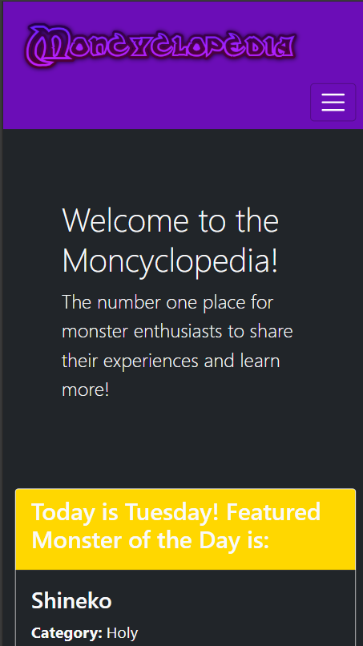
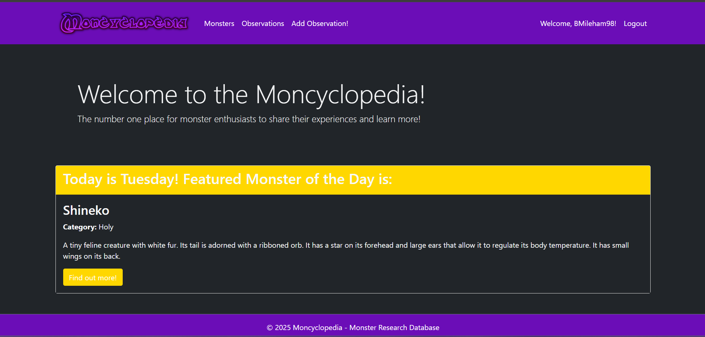
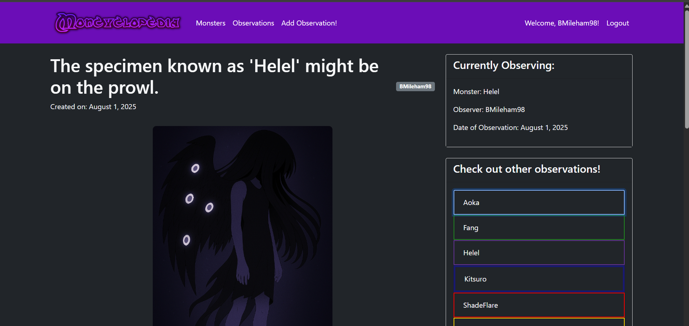

# Moncyclopedia

## Introduction

Welcome to the Moncyclopedia! This is a site dedicated to cataloguing and observing fictional monsters, aimed to echo the real enthusiasm of folklore and cryptid fans. Everything on this site is written as though these monsters are a newly discovered part of the fictional world it features! From cute critters to aliens and gods, I wanted to capture the excitement of a fantasy world which my new knowledge of the Django Framework has enabled me to explore. 

## UX Design

### Goal

The aim in building this project was creating a collaborative space that gives users a smooth experience in discovering new creatures and sharing their own findings, taking inspiration from Wiki sites and painting it with my own personal polish. I wanted to convey the sense of wonder I would get from reading up on my favourite media series as a kid and getting lost in the fun of fantasy. 
Care was taken in both making the site responsive but also having a colourful scheme that did not clash excessively in my endeavour for colour-coordinating based on monsters' categories. 

### User Stories

The project board for this site can be found [here](https://github.com/users/BMileham98/projects/7), below I shall provide the user stories by their priority. 

#### Must-Haves

- As a monster enthusiast, I want to see listings for each monster so that I may further my knowledge
- As a monster enthusiast, I wish to be able to report my findings so that I may discuss them with others
- As a user, I want to be able to comment my own observations so that I may contribute to the discussion

#### Should-Haves
- As a commenter, I want to upload images of my findings so that I may back up my claims
- As a user, I would like to see some unique styling to the pages for a more pleasant aesthetic
- As a monster enthusiast, I would like to be able to add new monsters to the site so that I may prompt new observations

#### Could-Haves
- As a user, I would like to see featured pages so that I may discover new monsters
- As a moderator, I want to be able to curate comments with images so that I may make a safer environment for our community

### Wireframes

Below are the wireframes for the home page in both desktop and mobile formats, as well as the rough concept for the monster entry page. These were made with Balsamiq.

.png)
.png)
.png)

### Aesthetic

The immediate concept for the colour scheme when this project was visualised was that parts of the layout would vary dependent on the monster that was recalled for each entry or observation, including on the lists, each dedicated page and the sidebar. This was implemented through recalling the category variable and using this for custom CSS. 

These colours were evaluated with some being lightened or darkened based on how much they blended in with each other. Additionally, I split the colour coding into background and border rules, to improve the aesthetic and protect against eye-strain for certain features. This was especially apparent in the sidebar on the observation_detail.html page, where the drop-down headers were stylised with the border- rules due to the background- rule clashing too badly. 

### Responsiveness

The project has been configured to be responsive across multiple screen-sizes, with the navbar providing a toggle on smaller mobile screens due to the amount of links. 

## Features

### Home Page

The home page is set up to display a different monster depending on the day using the datetime module, each category variable is assigned to a weekday which will feature any monster with that category. This is future-proofed so additional monsters will be added into the rotation without further coding needed. 

### Monsters

Monsters are recalled in alphabetical order to form a list, with badges to indicate their corresponding elements. When clicked, this will lead to a profile for each monster with basic stats such as their size or diet as well as some trivia such as the etymology. Each monster's entry also automatically collects all observations made for that monster, which provides a quicker method of locating other users' findings as opposed to clicking onto the observation list and scouring. 

The monster entry page also features a sidebar with links to other monsters, saving additional clicks to continue browsing. The sidebar has been configured so the current monster is separated from this list.

There is also a comment section on the monsters' entries to prompt further discussion outside of observations.

### Observations

The observation list automatically collects observation entries submitted for each monster and provides them with the most recent entry first. The list overall is alphabetical with borders dependent on the monster's category to prove more colour without the potential eye strain of solid colour. It keeps track of the number of observations. 

The entry features a sidebar that turns each monster's section into a dropdown to speed up loading as well as prevent the page becoming too cluttered. There is also a comment section to encourage users to contribute towards others' findings. 

### Submitting Observations

The site allows users not only to comment on monsters and the site owner's findings but also to contribute their own, to truly emulate the collaborative nature of Wiki sites. The dropdown option for monsters lets each observation instantly be matched to the corresponding monste ID so that it can be displayed on its individual entry. This should be future proofed for the potential addition of user-submitted monsters too.

## Future Refinements

There is a fair amount of features I would like to add or refine to this project, in order to both make the site more polished and allow for further collaboration. 

Image submission for comments is only partially implemented, the form for users fails to show a submission field and there is no code to display such an image, although it is accommodated for in the Comment model. Through the admin panel, it can be seen that images are correctly uploaded to Cloudinary. I hope to be able to fully implement this as well as selective comment moderation.

There is not currently a page to allow users to submit their own monsters, this is something I would also implement with further time. The model for monsters has been built around this however, with the categories being coded to accept only the 7 categories I have decided so that functionality such as filtering would not break. 

Additionally, there are layout changes that could improve the experience. Though most the monsters are established as scientically observed or proven, there is the extra category of 'Outsider' I would implement for monsters akin to aliens or cryptids like Bigfoot. 'Helel' is an example of one of these monsters intended to fill such a purpose. A small layout change I would implement is the use of a pop-up modal serving as a disclaimer for speculation or unverified monsters. 

## Testing

### Performance and Validation

Lighthouse performance tests were run while using Microsoft Edge's InPrivate mode after initially encountering lag caused by extensions.The tests consistently ranked high for Accessibility, Best Practices and SEO, however the performance originally floated around 90 in these runs even with disabled extensions. 
Through scanning the feedback I found that my Kaspersky antivirus' script injection was causing delays of up to 1600ms. Therefore by disabling it, I found my score increased. I imagine this new score will more accurately reflect the site's performance. 

HTML Validation shows no errors besides an issue rendering the monster_detail.html where it adds an additional set of paragraph tags to the description. This issue is not visible on the site itself, however. I believe this may be caused by extra tags being stored in the database, as there's only one set of paragraph tags in the template. 

CSS Validation is clear! No errors found.

### Optimisation

Over the course of developing this site, I encountered and patched many issues in-between commits. A lot of these were regarding styling, especially when it came to responsiveness. 

For example, I found that my navigation bar often needed tweaks to look right in both mobile and desktop forms. This was especially clear on mobile when the navbar was initially a large block of links in the header. This made the site look overcrowded even before viewing the content. 
To fix this, I implemented a toggle that hid the links on smaller screens and allowed for a more visually pleasant experience. This was done using bootstrap properties such as 'data-bs-toggle'. 
Additionally, classes such as 'ms-auto' and 'me-auto' were used to organise the nav-items for a less cluttered layout. 

Additionally, the images used in the project were of different sizes, requiring a uniform styling rule for consistency in accordance to the acceptance criteria of the user-story 'Monster Listings'. 
As img-fluid did not correctly resize the images, two classes were created - 'monster-image-contain' for the monster listings and 'monster-image-observe' for the observation pages. This allowed me to have consistency with the images while also accommodating for the different layouts. 

### User Stories processes

Due to teaching myself new functions within the Django framework to match the criteria of my user stories, I was required to test each function and at times tried to purposely break the functions to ensure the site's features were protected against unexpected behaviour. Below I will detail how I added the functionality required for each user story and how I ensured they worked as intended. I will also address those that were partially implemented or planned, as I have future-proofed my code in areas for these particular user stories. 

#### "As a monster enthusiast, I want to see listings for each monster so that I may further my knowledge"

For this user story, I created a model that would handle all monsters and additionally aimed to create a standardised layout so there would be consistency between the articles.

To handle this, the 'monster_detail.html' template was created to recall information stored in the database and print out the relevant facts for each monster. An issue that was highlighted in development however was in regards to the monsters' categories.
These categories are used to colour code each monster, for example "bg-{{ monster.category|lower }}" is used in the template to apply the relevant class, "bg-chaos" being associated with midnight blue. To future proof the model for future monster submissions, the category variable was assigned a list of preset choices so that users are unable to use any invalid variable names that would destroy the styling. 
This also accommodates for factors such as case-sensitivity. 

#### "As a monster enthusiast, I wish to be able to report my findings so that I may discuss them with others"

This involved implementing the 'Observation' model to function in accordance with the 'Monster' model so that observations could be easily linked to and referenced on the monsters' respective pages. This worked by using a ForeignKey field, which created a dropdown menu in the submission form. 

The observations for each monster are grouped through both the 'monster_detail' and 'observation_list' views, displaying these for the user in the pages for both the observation list and the monsters' entries. This improves the user experience by making it easier to find the relevant information for each monster. 

Additionally, the submission form for the observations both labels mandatory fields and stops incomplete entries from being submitted, moving the cursor to the first empty required field. 

Lastly, the sidebar on the observation pages list additional entries for the user to view, grouped by monster. This feature had some adjustment for the styling - initially the entirety of the header was the corresponding category's colour. However, this contrasted badly with the text colour for lighter colour classes like 'bg-aeries'. To create a more pleasant experience, this block of colour was changed to a border. 

#### "As a user, I want to be able to comment my own observations so that I may contribute to the discussion"

Observation and monster entries have an embedded crispyforms comment function, which interacts with the CommentForm. User authentication is used so that all comments are linked to accounts, with a prompt appearing to log in if the condition isn't met. 
The comment author is also checked against the current user's data to verify if they have permission to edit or delete the comment, this has been tested through creating additional accounts to confirm these buttons were not always available. 

#### "As a commenter, I want to upload images of my findings so that I may back up my claims"

This is a function that was accommodated for in the Comment model, however it is not currently fully implemented. The model contains a field for submitting images that reflects in the admin interface, however possibly due to the change from a standard comment view to using crispyforms, it does not appear as an option for standard users submitting a comment. 
Additionally, images submitted through the admin interface do not currently appear due to a lack of code to handle this. However, these are correctly uploaded to Cloudinary and therefore could be fully functional with a few minor changes. 

#### "As a user, I would like to see some unique styling to the pages for a more pleasant aesthetic"

This user story was completed by creating several classes to visually distinguish between monsters while keeping to the more uniform structure the templates allowed. For example, each category was assigned its own colour, listed within the :root class so that these could be easily used across multiple other styles. This manifested in the assortment of background and border classes such as bg-chaos and border-chaos. 

These are most commonly seen in the monster and observation entries, as well as in the sidebar on each of these. Additionally, these were used to create badges in the monster list page so each monsters' categories could be viewed before clicking onto their entries. 
Through doing this, it creates a colourful site even with the heavy use of 'bg-dark', which was chosen as splashes of colour among a darker theme are personally aesthetically pleasing. 

#### "As a monster enthusiast, I would like to be able to add new monsters to the site so that I may prompt new observations"

This feature was not fully implemented due to time constraints, I believe I had the framework set up correctly as I added each monster through the admin panel. The model for Monster fully accommodates for user input such as limiting the choice for Category so it does not interfere with styling, therefore it has potential for future progress. 

This would require a new template and view, however the observation forms and views provide a decent starting point for enabling user input. 

#### "As a user, I would like to see featured pages so that I may discover new monsters"

This feature was brainstormed early in planning but has gone through some changes for the sake of future-proofing. The initial plan was for the weekdays to correspond to a monster's ID, however I found that altering this to work with categories instead allow for additional entries to be displayed. 

I created a view for this feature that scans the available monsters for a given category and randomly selects one, therefore when user-submitted monsters are implemented, they will be able to have their monsters added to the pool automatically.

#### "As a moderator, I want to be able to curate comments with images so that I may make a safer environment for our community"                                                                                                                      
This feature was not implemented however I believe this would be possible. This requires the functionality for images appearing with comments to be fixed, but the plan was for imageless comments to be automatically accepted so the flow of conversation does not feel as limited. Curating images is an internet safety matter.

## Deployment Process

The site was deployed using Heroku, this environment proves very useful for Django projects due to its ability to store sensitive strings such as secret keys and urls using Config Vars. This allowed for safe hosting of the project due to not needing the local env.py file to function.

These were the steps used to prepare the project for deployment:

1. Installed gunicorn to set up the server with Heroku
2. Used whitenoise to handle static files
3. Added a Procfile set up with gunicorn
4. Maintained the requirements.txt to provide the list of mandatory packages for Heroku
5. Configured the settings.py to toggle DEBUG based on the env.py's presence, preventing accidental deployment with DEBUG enabled. 
6. Added Heroku to ALLOWED_HOSTS
7. Connect Github to Heroku
8. Set Config Vars for necessary variables such as the database URL, Cloudinary configuration and the secret key. 
9. Apply migrations with 'python manage.py migrate' and 'python manage.py makemigrations' then collect static files.
10. Deploy the project in Heroku.

Depending on deployment settings, the project may need regularly deploying to keep it up to date with Github commits. 

## Credits

First, Code Institute is to be credited for teaching me how to use the Django framework and improving my knowledge of the HTML, CSS and Python languages. 

Bootstrap was used as a base for many parts of the site, such as the navbar and building the structure of the monster entry page. 

The concept of the site was inspired by Wiki sites, such as Bulbapedia and those hosted by Fandom.

W3Schools was referenced, especially in finding the correct colours for the layout.

Co-Pilot was also used, as detailed below. 

### AI Declaration

Github Co-Pilot proved useful in troubleshooting code and also served as a framework I built on, helping me to gain an idea of how to implement certain features as well as to check if such functions were in the scope of the project. 

This allowed me to identify ways to fulfill features such as the featured monsters' function, I used the AI assistant as a teaching tool here to show me the feasibility of my idea. This additionally included requesting for the AI to break down and explain example code so that I gained new knowledge for each feature and implemented it knowing both how it worked and how to tweak it to fit in. 

I additionally learnt this way how to spot errors in pre-generated code, which I used as an opportunity to learn how to test my projects so I would have more confidence in my ability to fix bugs. I found using the AI to check for errors could cut down on some of the workload, finding difficult to spot errors like missing syntax, however I made sure to manually test the code myself as well due to some errors being less obvious. This includes styling errors where the script itself may not have any glaring issues, these became much more apparent when testing on both the test server and deployed version.

Consulting Co-Pilot was additionally helpful when running performance tests. While manually running the Lighthouse performance tests, I took measures to minimise delay such as running the site without extensions. However, I found that a large amount of the delay was due to my antivirus interacting with the site via script injection. While this was discovered myself through manual testing, I consulted AI to determine how to disable this. 

While I have written the contents of this README myself, Co-Pilot was useful in getting my thoughts out and pointing me in the right direction. It provided me a brief idea of how to brainstorm the documentation and breaking down topics that I found confusing. 

Additionally, the images used on the site were generated as placeholders, based on prompts of my descriptions of creatures from another personal creative project. 

